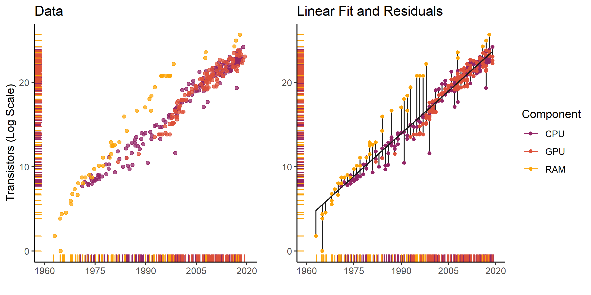

This document compiles neat outputs from Tidy Tuesday projects. This repo contains code to build those outputs.

Everything originates with the wonderful [Tidy Tuesday](https://github.com/rfordatascience/tidytuesday/blob/master/README.md) project. 

# Moore's Law | Week 36 (2019-09-03)

I visualized residuals on a linear model of Moore's Law.

I also checked out distributions of residuals over interesting covariates.

# National Park Visits | Week 38 (2019-09-17)

I animated visits to National Parks in Alaska since 1955.

# Canadian Wind Turbines | Week 44 (2020-10-27)

Well, I *should* do something for this.