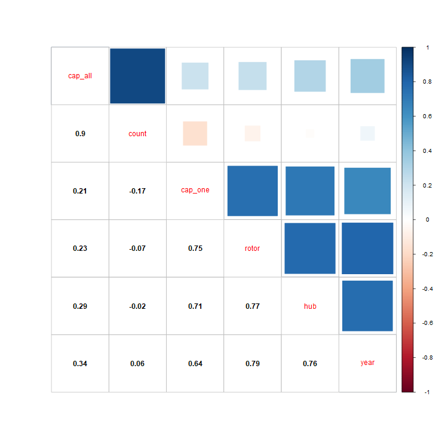
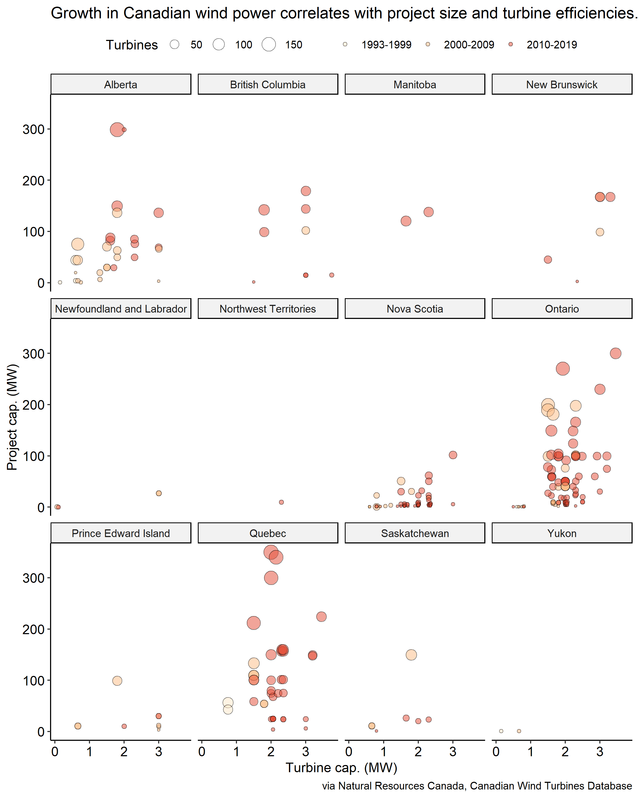

Goal: check out counts, capacities, and footprints for wind projects across Canada.

# Packages
```{r packages}

library(tidyverse)
library(corrplot)
library(ggpubr)

```

# Data
```{r data}

dat = read_csv('https://raw.githubusercontent.com/rfordatascience/tidytuesday/master/data/2020/2020-10-27/wind-turbine.csv')

```

# Explore
```{r explore}

# Check for interesting correlations in numeric data.
png("vis_cor.png", 
    750,
    750,
    type = 'cairo')

vis_cor = 
  dat %>% 
  select(cap_all = total_project_capacity_mw,
         count = turbine_number_in_project,
         cap_one = turbine_rated_capacity_k_w,
         rotor = rotor_diameter_m,
         hub = hub_height_m,
         year = commissioning_date) %>% 
  mutate(count = count %>% str_extract("\\b\\w+$") %>% as.numeric, # Get operation size from turbine number.
         year = ifelse(is.na(as.numeric(year)),
                       str_extract(year, "\\b\\w+$") %>% as.numeric, # For ambiguous commissioning years, get the later year.
                       year %>% as.numeric)) %>% # For unambiguous commissioning years ... just get the year, I guess.
  drop_na %>% # There are ~400 NAs for turbine capacities.
  cor(use = "pair") %>% # 
  round(2) %>% 
  corrplot.mixed(upper = "square",
                 lower = "number",
                 lower.col = "black")

dev.off()

```



Well, this is straightforward aside from the count variable. Capacities go up with turbine size on two dimensions. Neat.

Without thinking too hard, I'd guess operations and turbines have grown along with their efficiencies.

So, next up is visualizing turbines per operation, megawatts per operation, and megawatts per turbine. Years and provinces might be nice, too.

# Visualize
```{r visualize}

vis_tur = 
  dat %>% 
  select(place = province_territory,
         project = project_name,
         cap_all = total_project_capacity_mw,
         count = turbine_number_in_project,
         cap_one = turbine_rated_capacity_k_w,
         year = commissioning_date) %>% 
  mutate(cap_one = cap_one / 1000, # Go from kilowatts to megawatts.
         count = count %>% str_extract("\\b\\w+$") %>% as.numeric, # Get operation size from turbine number.
         year = 
           ifelse(is.na(as.numeric(year)),
                  str_extract(year, "\\b\\w+$") %>% as.numeric, # For ambiguous commissioning years, get the later year.
                  year %>% as.numeric), # For unambiguous commissioning years ... just get the year, I guess.
         year = ifelse(year < 2000, 
                       "1993-1999",
                       ifelse(year < 2010,
                              "2000-2009",
                              ifelse(year < 2020,
                                     "2010-2019")))) %>% # Go from years to ~decades for easier visualization.
  group_by(place, project, year) %>% 
  summarize(cap_one = mean(cap_one, na.rm = TRUE),
            cap_all = mean(cap_all, na.rm = TRUE),
            count = mean(count, na.rm =TRUE)) %>% # Summarize from turbine to project.
  drop_na %>% # There are ~400 NAs for turbine capacities.
  ggplot() +
  geom_point(aes(x = cap_one,
                 y = cap_all,
                 size = count,
                 fill = year),
             color = "black",
             alpha = 0.50,
             shape = 21) +
  scale_fill_brewer(palette = "OrRd") +
  labs(x = "Turbine cap. (MW)",
       y = "Project cap. (MW)",
       fill = "",
       size = "Turbines",
       title = "Growth in Canadian wind power correlates with project size and turbine efficiencies.",
       caption = "via Natural Resources Canada, Canadian Wind Turbines Database") +
  theme_pubr() +
  facet_wrap(~ place)

ggsave("vis_tur.png",
       width = 8.0,
       height = 10.0,
       dpi = 300)

```



Knowing that turbine capacities and turbine counts correlate with project capacities, this is a tidy way to show the obvious.